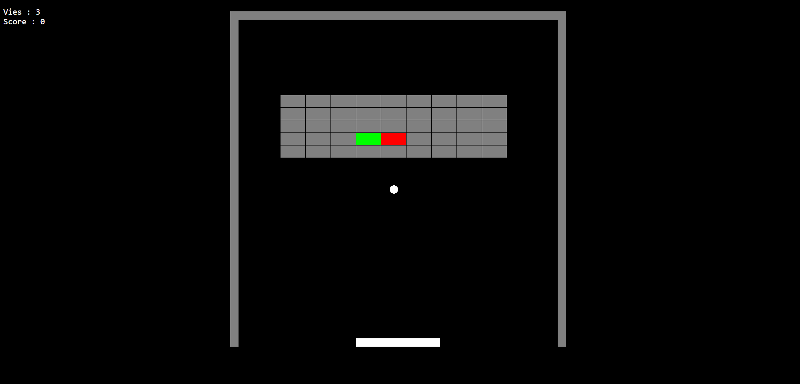

# casse-brique
Devoir en classe du 07/02/2022

## Objectif:
Réaliser un casse brique simple au moyen de Phaser 3 en respectant les consignes suivantes et en vous inspirant du pong réalisé ces dernières séances.

Merci de réaliser les différentes étapes **dans l'ordre**.

Dans ce repo vous trouverez les assets nécessaires. Vous pouvez reprendre le code de votre pong, vous pouvez consulter la documentation Phaser. Vous n'avez évidemment pas le droit de communiquer entre vous.

## Consignes

### Créez un repo github... 
...intitulé "casse-brique" et envoyez moi le lien github pages en private sur discord.

### Mettre en place un jeu aux caractéristiques suivantes :

- 800px / 800px
- Les murs mesurent 20px.
- la raquette mesure 200px / 20px
- la balle mesure 20px
- les briques mesurent 60px / 30px
- le jeu doit ressembler le plus possible à l'exemple (couleurs, tailles, nombre de briques, position des briques etc...). 

### La raquette

- le rebond de la balle sur la raquette doit être directionnel. Plus la balle tape à gauche plus l'angle de rebond ira vers la gauche et inversément.
- la raquette ne doit pas sortir du terrain.

### points

- en haut à gauche sont affichées les vies et le score **en HTML**.
- chaque brique détruite raporte un point
- la brique rouge raporte 10 points

### vies

- chaque partie commence avec 3 vies
- la brique verte permet de gagner une vie de plus.

### perdu

- quand le joueur n'a plus de vie, il a perdu
- quand cela se présente le programme affiche "Perdu" en alert. `alert("perdu");`
- la partie recommence (3 vies, score à zéro, balle au centre, briques remises à zéro) 

### gagné

- quand le joueur a cassé toutes les briques, il a gagné
- quand cela se présente le programme affiche "Gagné !" en alert.
- la partie recommence (3 vies, score à zéro, balle au centre, briques remises à zéro) 

